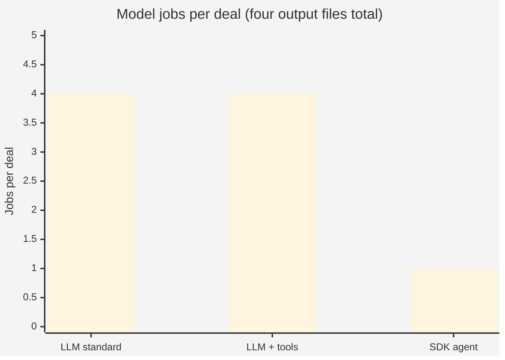
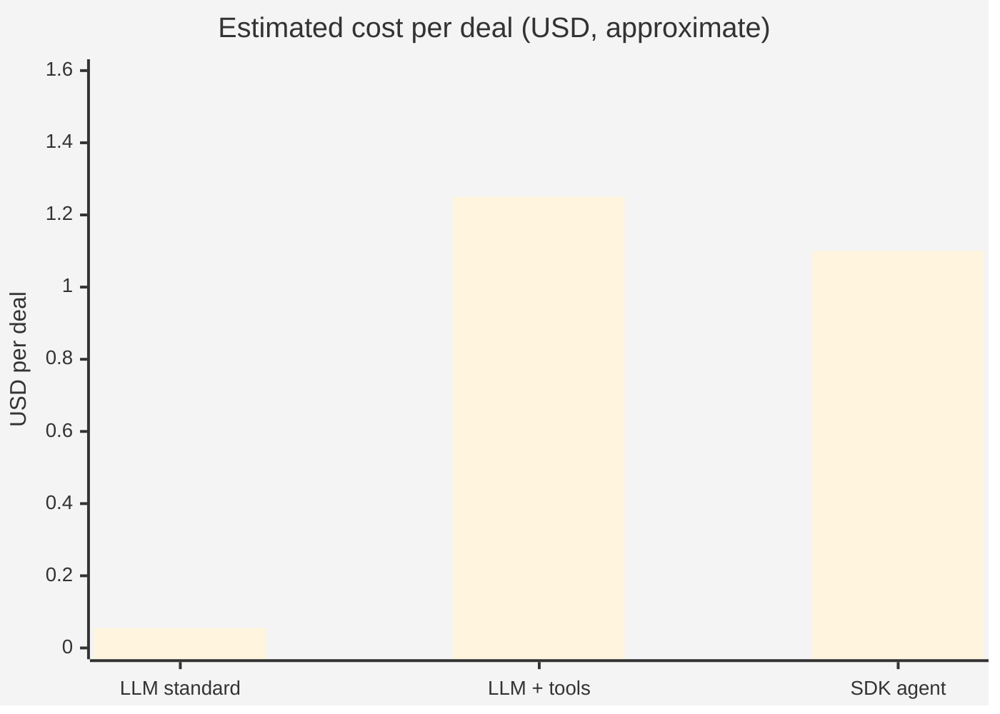
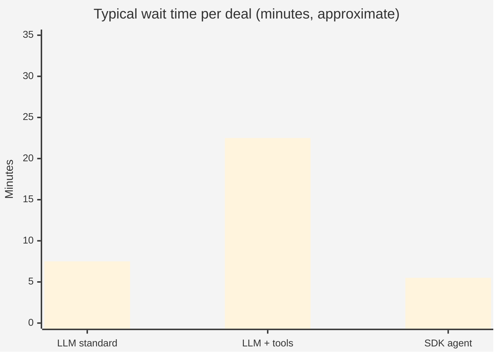

# API & usage comparison (charts for non-technical audiences)

Use this in slides or Word. **Do not** present tool-calling as “14 × 4 = 56 API calls” — that counts internal back-and-forth **inside** each extraction job and confuses finance and operations readers.

**Recommended headline metric:** **Model jobs per deal** = how many times we ask the AI to produce one deliverable file (`01`–`04`). All three paths produce **four files**; billing shape differs.

---

## Chart 1 — Model jobs per deal (what to put on the slide)

| Path | Model jobs per deal | Plain explanation |
|------|---------------------|-------------------|
| **LLM — standard** | **4** | One AI request per output file; pages are pre-selected by rules. |
| **LLM — function calling** | **4** | Same four jobs; the model can **look up pages between steps** inside each job (not extra jobs on the invoice). |
| **SDK agent** | **1** | One Cursor agent session writes all four files in one run. |



**Speaker note:** Function calling does **not** mean 56 separate bills. It means each of the **four** jobs may involve several automatic “open page 5” steps **before** that file is finished — still **one job per file** from a planning perspective.

---

## Chart 2 — Estimated cost per deal (short noteval, ~12–20 pages)

Figures are **approximate** from project usage logs (not vendor invoices). Ranges reflect typical vs heavy runs.

| Path | Cost per deal (approx.) |
|------|-------------------------|
| **LLM — standard** | **$0.03 – $0.08** |
| **LLM — function calling** | **$1.00 – $1.50** |
| **SDK agent** | **$0.75 – $1.50** |



*Chart uses midpoints ($0.055, $1.25, $1.10) for display; use the table ranges in narrative.*

**Why tool mode costs more with the same “4 jobs”:** Each job sends a **growing conversation** (page index + chunk text from earlier lookups). You pay for **tokens**, not for counting each lookup as a separate product.

---

## Chart 3 — Typical wait time per deal (your clock)

| Path | Typical wait |
|------|----------------|
| **LLM — standard** | **5 – 10 min** |
| **LLM — function calling** | **15 – 30 min** |
| **SDK agent** | **3 – 8 min** |



*Midpoints for display: 7.5, 22.5, 5.5 minutes.*

---

## Chart 4 — Who bills you (one row per vendor)

| Path | What shows on the bill | Counting unit for executives |
|------|------------------------|------------------------------|
| **LLM — standard** | **OpenAI** (or compatible API) | **4** chat completions per deal |
| **LLM — function calling** | **OpenAI** (same product) | **4** extraction jobs; each job = one completion **session** per file |
| **SDK agent** | **Cursor** (agent API) | **1** agent run per deal |

---

## Optional appendix (technical only — not for main slide)

| Path | HTTP calls to OpenAI/Cursor (engineering) |
|------|-------------------------------------------|
| LLM standard | **4** (`/chat/completions` once per file) |
| LLM + tools | **~4–40** (up to **14** round-trips **per file**, default cap) |
| SDK agent | **1** agent invocation; many internal tool steps inside |

Keep this slide **behind** the business charts or in an appendix so non-technical audiences are not asked to reconcile “4” vs “56”.

---

## Suggested slide title and one-liner

**Title:** How the three extraction paths compare (usage & cost)

**One-liner:** All paths produce the same four files; **standard LLM** is cheapest with four simple requests; **function calling** uses the same four jobs but costs more because each job reads more pages; **SDK** uses one agent session and is often fastest on short reports.

---

## Export to Word

```powershell
py -3 -c "import pypandoc; from pathlib import Path; md=Path(r'noteval_extractor/docs/API_Usage_Comparison_Chart.md'); pypandoc.convert_file(str(md), 'docx', outputfile=str(md.with_suffix('.docx')))"
```

Requires `pip install pypandoc_binary` (once).
