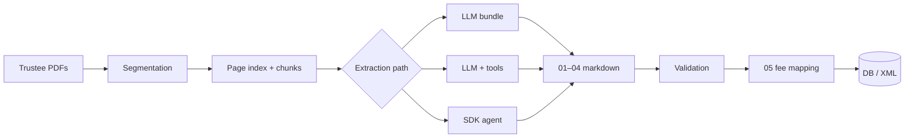

<!-- _class: lead -->

# Noteval Report Extraction

### From trustee PDFs to validated, database-ready data

**Status update & proposals** · May 2026

---

## Executive summary

- **Goal:** Turn monthly CLO / ABS **note valuation and payment-date PDFs** into **consistent, auditable structured data** for valuation and warehouse ingestion.
- **Today:** A working **end-to-end pipeline** — segment PDFs → extract four core deliverables → validate → map fees → optional XML/Excel export.
- **Proof:** **12 deals** processed in the current output library; comparison runs across **three extraction approaches** with measured cost and quality.
- **Ask:** Align on a **production mix** (speed vs. cost vs. accuracy) and next-phase investment (batch scale-up, DB feed, trustee expansion).

---

## The business problem

| Challenge | Impact |
|-----------|--------|
| Trustee PDFs vary by **bank, layout, and vintage** | Manual extraction is slow and inconsistent |
| Valuation needs **class balances, waterfalls, and fee cash** with **page-level audit trail** | Errors in “paid” vs “remaining” columns are costly |
| Downstream systems need **stable field names** (not free text) | Ad hoc spreadsheets don’t scale to the database |

**Success looks like:** Repeatable extraction with **Source Text citations**, automatic **validation flags**, and a path to **XML / DB load**.

---

## What we deliver (per deal)

Structured markdown (and exports) in a single deal folder:

| File | Content |
|------|---------|
| **01** Report metadata | Dates, deal IDs, trustee name |
| **02** Tranche / class balances | Distribution in US$, coupons, multi-listing |
| **03** Interest & principal waterfall | Full ladder + admin grids |
| **04** Extraction summary | Coverage, notes, dual-PDF routing |
| **05** Valuation-relevant fees | Normalized fee categories for valuation |
| **validation_report.md** | Automated completeness and tie-out checks |

---

## Platform we built (effort to date)

```
Trustee PDF(s)  →  Segment  →  Extract  →  Validate  →  Fees map  →  Export
```

**Core components**

- **Web UI** (`server.py`) — segment deals, run LLM pipeline (single or batch), SDK agent, view outputs
- **Segmentation** — page index, chunk files, manifest; **Wells Fargo dual-PDF** support
- **Extraction playbook** — `SKILL.md` + `extraction-templates.md` (strict schemas, fee taxonomy)
- **LLM layer** — chunk routing, optional index enrichment, function-calling tools
- **SDK path** — Cursor agent for highest-quality runs (`*_sdk` folders)
- **Validation & gates** — `validate_noteval.py`, primary-PDF quality gate
- **Documentation** — technical + plain-language LLM vs SDK comparison (Word export)

---

## Architecture (one picture)



All paths share the **same prepared folder** — we only change **who picks which pages** and **how many model round-trips** occur.

---

## Three extraction paths (not one-size-fits-all)

| Path | How it works | Best for |
|------|----------------|----------|
| **A — LLM bundle** | Rules pre-pack pages; one API call per file | High-volume batch, **lowest cost** |
| **B — LLM + function calling** *(UI default)* | Model requests specific pages via fixed tools | **Production balance** — fewer wrong-page errors, batch-friendly |
| **C — SDK agent** | Full playbook + Read/Grep/Shell in one job | **Hardest layouts**, Wells Fargo dual PDF, quality benchmarks |

*Analogy:* Bundle = pre-packed envelope · Tools = recipient asks for pages from the filing cabinet · SDK = analyst with full building access.

---

## Cost & time (short noteval, ~12–20 pages)

*Estimates from project usage logs — not invoices.*

| Path | Cost / deal | Typical wait | Quality |
|------|-------------|--------------|---------|
| LLM bundle | **~$0.03–$0.08** | ~5–10 min | Good when page index is clear |
| LLM + tools | **~$1.00–$1.50** | ~15–30 min | Better page selection |
| SDK agent | **~$0.75–$1.50** | ~3–8 min | **Usually best** (rollup, paid columns) |

**Segmentation** adds ~½–1 min per PDF (same for all paths).

**Insight:** On short noteval, **SDK is competitive with tools on cost and often faster** — bundle remains the **50× cheaper** bulk option.

---

## Quality learnings (why this matters)

Documented rules now encoded in the playbook:

- **Amount paid only** — never “remaining” or discretionary columns
- **Program slices** — e.g. `A-R-144A` + `A-R-REGS` → **one** primary row `A-R` + listing detail
- **Wells Fargo** — separate note-val vs waterfall PDFs; admin grid on note-val, fees from waterfall
- **Computershare PDD/IDD** — class name from **Note Class**, not CUSIP; **Sub Totals** for primary $
- **Fee vs class cash** — interest/principal stay in **02**; valuation fees in **05** with stable **Sub category** codes

Validation catches gaps before data reaches valuation systems.

---

## Proof of work — current deal library

**12 deals** with full extraction outputs in `noteval_extractor/output/`:

- Mix of trustees and payment dates (2024–2026)
- Includes **dual-segmentation** runs (e.g. Wells Fargo waterfall + note-val)
- Each folder: deliverables **01–05**, `validation_report.md`, chunks + page index

*This demonstrates repeatability across layouts, not a one-off demo.*

---

## Supporting investments

| Area | What we did |
|------|-------------|
| **Trustee-specific skills** | `read_noteval`, logical disbursements, tranche detail (CS-Structured-Skills integration) |
| **Structured table hints** | Optional `pdfplumber` for PDD/IDD grids |
| **Batch operations** | `deal_paths.csv`, batch segment, batch LLM with shared settings |
| **Cost tracking** | API usage logs for LLM and SDK |
| **Comparison docs** | Manager-ready plain language + engineer technical write-up |

---

## Proposal 1 — Hybrid production model

**Recommended operating model:**

| Tier | Path | When |
|------|------|------|
| **Bulk** | LLM bundle | Clean index, high volume, cost-sensitive |
| **Default production** | LLM + function calling + validate | Standard monthly noteval queue |
| **Exception / QA** | SDK agent | New trustee, dual PDF, validation failures, benchmark deals |

**Outcome:** Predictable cost at scale without sacrificing accuracy on hard deals.

---

## Proposal 2 — Path to database ingestion

**Near-term (already partially built):**

1. Stable **05** fee taxonomy → XML export spec (`xml-export.md`)
2. **Validation gate** before publish — no load when critical checks fail
3. **Excel export** for analyst review alongside markdown

**Next:**

- ETL mapping from **Sub category** literals to warehouse keys
- Scheduled batch from `deal_paths.csv` with status dashboard
- Retention policy for **Source Text** (audit vs storage cost)

---

## Proposal 3 — Expand coverage & reduce manual touch

| Initiative | Benefit |
|------------|---------|
| More trustee layouts in playbook | Fewer SDK-only exceptions |
| Human review UI in web app | Faster sign-off on flagged validation items |
| Re-run on validation failure | Auto-fix loop (SDK or targeted re-extract) |
| Optional vision for **02** tables | Hard grid layouts on server LLM path |
| Programmatic parsers (`read_noteval_*`) | Zero-LLM path for USB / Deutsche where rules exist |

---

## Risks & mitigations

| Risk | Mitigation |
|------|------------|
| Model cost drift | Usage logs + per-deal cost report; tiered paths |
| Wrong PDF type in batch | Primary PDF gate + bypass only when intentional |
| Layout not in playbook | SDK benchmark → encode rule → validate |
| API / key dependency | OpenAI for LLM; Cursor for SDK — document fallbacks |

---

## What we need from leadership

1. **Confirm target SLA** — e.g. % of deals auto-pass validation vs analyst review
2. **Approve production mix** — bundle vs tools vs SDK by deal type
3. **Prioritize DB feed** — timeline for XML/warehouse integration
4. **Resourcing** — trustee expansion vs automation vs review headcount

---

<!-- _class: lead -->

# Thank you

**Artifacts:** `noteval_extractor/docs/` · Live UI: `server.py`  
**Deep dive:** `LLM_vs_Agent_Comparison_Plain_Language.md`

*Questions & feedback welcome*
